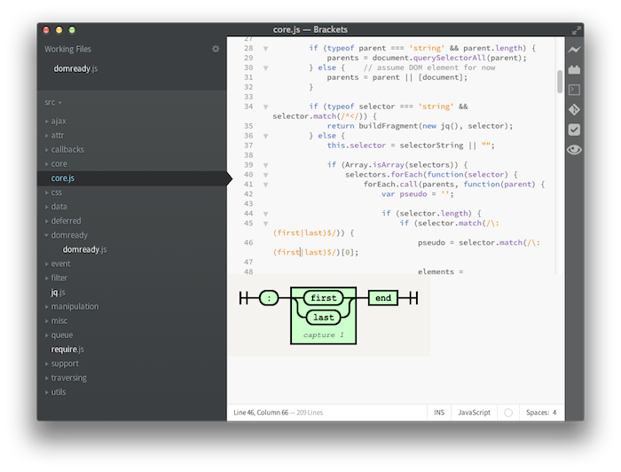

brackets-regex-diagram
======================

A regular expression railroad diagram view for regexp under the cursor. This was written so that I can get familiar with Brackets development.

This extension is heavily based on:

* [regex-railroad-diagram package](https://github.com/klorenz/atom-regex-railroad-diagrams) Atom extension by [@klorenz](https://github.com/klorenz/)
* [railroad-diagrams](http://github.com/tabatkins/railroad-diagrams) Rairoad Diagrams by [Tab Atkins Jr.](http://twitter.com/tabatkins)

### How to use it?

Install the extension and move your cursor over a regular expression, for example:

`/^foo/`

The extension will automatically display the diagram of the RegExp found under the cursor.

### How disable it?

The extension appends a new entry called *Show RegExp Diagram* into the View menu that is toggled by default.

To disable the extension, simply select this menu entry.

### Limitations

* The extension won't detect regexp found inside strings (eg. `new RegExp("^foo")`)
* Complex RegExp may not be rendered correctly
